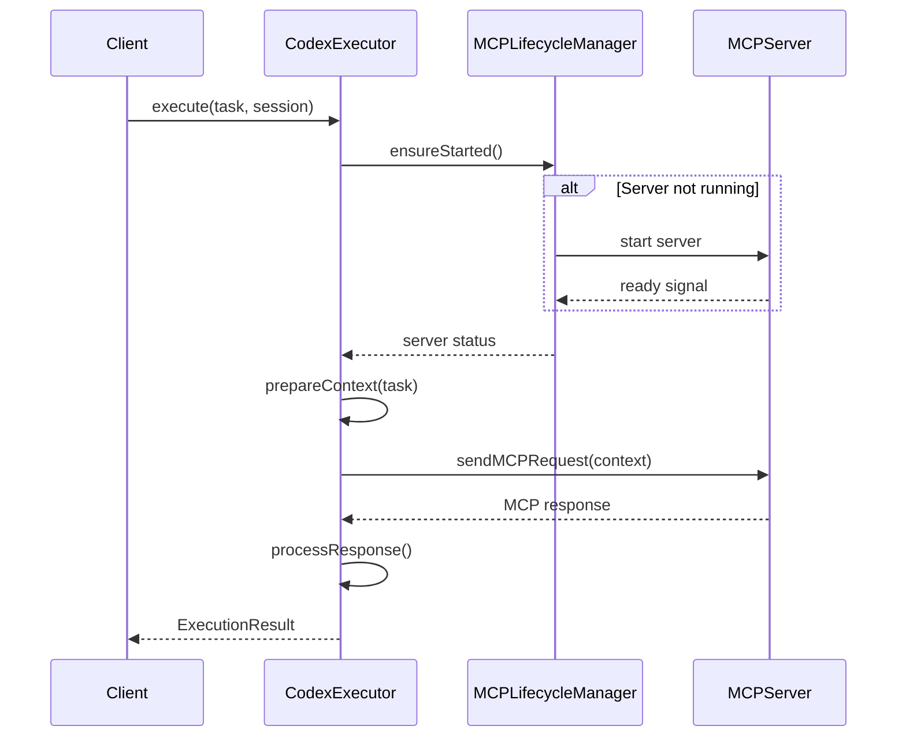

# CodexExecutor - Codex执行器

## 概述

`CodexExecutor` 是Codex工作流编排系统的核心执行组件，负责：

- 管理与MCP服务器的通信
- 执行Codex任务并返回结果
- 集成`MCPLifecycleManager`确保MCP服务器就绪
- 处理请求超时和取消
- 转换MCP响应为标准化的执行结果

## 架构设计

### 核心组件

```
┌─────────────────────────────────────────────────────┐
│                  CodexExecutor                      │
├─────────────────────────────────────────────────────┤
│                                                     │
│  ┌──────────────────────────────────────────────┐ │
│  │       MCPLifecycleManager                    │ │
│  │  - ensureStarted()                           │ │
│  │  - stop()                                    │ │
│  │  - healthCheck()                             │ │
│  │  - getStatus()                               │ │
│  └──────────────────────────────────────────────┘ │
│                                                     │
│  ┌──────────────────────────────────────────────┐ │
│  │       执行流程                                │ │
│  │  1. 确保MCP服务器启动                         │ │
│  │  2. 准备执行上下文                            │ │
│  │  3. 发送MCP请求                               │ │
│  │  4. 处理响应                                  │ │
│  │  5. 返回执行结果                              │ │
│  └──────────────────────────────────────────────┘ │
│                                                     │
│  ┌──────────────────────────────────────────────┐ │
│  │       请求管理                                │ │
│  │  - activeRequests: Map<id, request>          │ │
│  │  - cancelRequest(id)                         │ │
│  │  - 超时控制                                   │ │
│  └──────────────────────────────────────────────┘ │
│                                                     │
└─────────────────────────────────────────────────────┘
```

### 执行流程



## 核心接口

### ICodexExecutor

```typescript
interface ICodexExecutor {
  // 执行任务
  execute(task: TaskDescriptor, session: Session): Promise<ExecutionResult>;

  // 准备执行上下文
  prepareContext(task: TaskDescriptor): Promise<ExecutionContext>;

  // 检查MCP服务器状态
  checkServerStatus(): Promise<MCPServerStatus>;
}
```

### ExecutionContext

执行上下文包含执行任务所需的所有信息：

```typescript
interface ExecutionContext {
  task: TaskDescriptor;           // 任务描述
  sessionId: string;               // 会话ID
  codebaseSnapshot?: CodebaseSnapshot;  // 代码库快照
  complexityScore?: ComplexityScore;    // 复杂度评分
  options?: ExecutionOptions;      // 执行选项
  customContext?: Record<string, any>;  // 自定义上下文
}
```

### MCP通信

#### MCPRequest

```typescript
interface MCPRequest {
  id: string;                      // 请求ID
  type: 'execute' | 'analyze' | 'think';  // 请求类型
  context: ExecutionContext;       // 执行上下文
  options?: {
    timeout?: number;              // 超时时间
    streaming?: boolean;           // 是否流式响应
  };
}
```

#### MCPResponse

```typescript
interface MCPResponse {
  requestId: string;               // 对应的请求ID
  status: 'success' | 'error' | 'timeout';  // 响应状态
  data?: {
    output: string;                // 输出内容
    generatedFiles?: string[];     // 生成的文件
    thinkingChain?: Array<{        // 推理链
      step: number;
      thought: string;
    }>;
    metadata?: Record<string, any>;
  };
  error?: {
    message: string;
    code?: string;
    stack?: string;
  };
  timestamp: Date;
}
```

## 使用示例

### 基础用法

```typescript
import { CodexExecutor } from './codexExecutor';
import { TaskDescriptor, Session } from './types';

// 创建输出通道
const outputChannel = vscode.window.createOutputChannel('Codex Executor');

// 创建执行器
const executor = new CodexExecutor(outputChannel);

// 定义任务
const task: TaskDescriptor = {
  id: 'task-1',
  type: 'design',
  description: 'Review design document',
  specName: 'my-feature',
  context: {
    requirements: 'Feature requirements...',
    design: 'Design document...'
  }
};

// 定义会话
const session: Session = {
  id: 'session-1',
  task,
  status: 'active',
  createdAt: new Date(),
  lastActiveAt: new Date(),
  context: {
    options: {
      timeout: 300000,
      enableDeepThinking: true
    }
  }
};

// 执行任务
try {
  const result = await executor.execute(task, session);

  if (result.success) {
    console.log('执行成功:', result.output);
    console.log('生成的文件:', result.generatedFiles);
  } else {
    console.error('执行失败:', result.error?.message);
  }
} catch (error) {
  console.error('执行异常:', error);
}
```

### 检查服务器状态

```typescript
const status = await executor.checkServerStatus();

console.log('服务器状态:', status.status);
console.log('进程ID:', status.pid);
console.log('端口:', status.port);
console.log('是否健康:', status.isHealthy);
```

### 准备执行上下文

```typescript
const context = await executor.prepareContext(task);

console.log('任务ID:', context.task.id);
console.log('会话ID:', context.sessionId);
console.log('自定义上下文:', context.customContext);
```

### 取消请求

```typescript
// 启动长时间运行的任务
const promise = executor.execute(task, session);

// 在需要时取消
setTimeout(() => {
  executor.cancelRequest('req-id');
}, 5000);
```

### 清理资源

```typescript
// 在扩展停用时清理
await executor.dispose();
```

## 错误处理

### MCP服务器启动失败

```typescript
try {
  const result = await executor.execute(task, session);
} catch (error) {
  if (error.message.includes('MCP server is not running')) {
    console.error('MCP服务器未运行，请检查Codex CLI是否已安装');
  }
}
```

### 请求超时

```typescript
const session: Session = {
  // ...
  context: {
    options: {
      timeout: 60000  // 1分钟超时
    }
  }
};

const result = await executor.execute(task, session);

if (!result.success && result.error?.code === 'timeout') {
  console.error('请求超时，请尝试增加超时时间或优化任务');
}
```

### 请求被取消

```typescript
const result = await executor.execute(task, session);

if (!result.success && result.error?.code === 'CANCELLED') {
  console.log('请求已被取消');
}
```

## 测试

### 运行单元测试

```bash
npm test -- codexExecutor.test.ts
```

### 测试覆盖范围

- ✅ 成功执行任务
- ✅ MCP服务器未运行时的错误处理
- ✅ MCP请求失败的错误处理
- ✅ 执行时长计算
- ✅ 上下文准备
- ✅ 服务器状态检查
- ✅ 服务器停止
- ✅ 请求取消
- ✅ 资源清理
- ✅ 模拟MCP请求
- ✅ 响应处理（成功、失败、超时）

## 实现细节

### MCP通信（当前实现）

当前实现使用模拟的MCP请求/响应机制（`_mockMCPRequest`方法），用于：

1. **开发阶段测试**：在实际MCP服务器实现之前验证逻辑
2. **单元测试**：提供可预测的测试环境
3. **接口定义**：明确MCP通信的数据结构

### TODO: 实际MCP通信实现

未来需要实现真实的MCP通信：

```typescript
private async _sendMCPRequest(context: ExecutionContext): Promise<MCPResponse> {
  const serverStatus = await this.mcpManager.getStatus();
  const endpoint = `http://localhost:${serverStatus.port}/api/execute`;

  const response = await fetch(endpoint, {
    method: 'POST',
    headers: {
      'Content-Type': 'application/json'
    },
    body: JSON.stringify({
      id: requestId,
      type: 'execute',
      context
    }),
    signal: controller.signal
  });

  return await response.json();
}
```

### 请求生命周期管理

每个MCP请求都被跟踪在`activeRequests` Map中：

```typescript
activeRequests: Map<string, {
  controller: AbortController;  // 用于取消请求
  startTime: Date;              // 用于超时检测
}>
```

这允许：
- 跟踪所有活跃的请求
- 支持请求取消
- 监控请求时长
- 在清理时取消所有未完成的请求

### 日志记录

执行器在关键步骤记录日志到VSCode输出通道：

- 任务开始执行
- MCP服务器状态检查
- 上下文准备
- MCP请求发送
- 响应处理
- 执行完成或失败

## 扩展点

### 自定义MCP请求类型

当前支持的请求类型：
- `execute`: 执行任务
- `analyze`: 分析任务
- `think`: 深度推理

可以通过扩展`MCPRequest.type`添加新的请求类型。

### 自定义上下文处理

通过`ExecutionContext.customContext`可以传递任意自定义数据：

```typescript
const context = await executor.prepareContext(task);
context.customContext = {
  ...context.customContext,
  myCustomData: {
    // 自定义数据
  }
};
```

### 响应后处理

可以继承`CodexExecutor`并覆盖`_processResponse`方法来添加自定义的响应处理逻辑。

## 依赖关系

```
CodexExecutor
  ├── MCPLifecycleManager (MCP服务器生命周期管理)
  ├── types.ts (类型定义)
  └── vscode (VSCode API)
```

## 相关文档

- [types.ts](./types.ts) - 核心类型定义
- [mcpLifecycleManager.ts](./mcpLifecycleManager.ts) - MCP生命周期管理器
- [design.md](../../.claude/specs/codex-workflow-orchestration/design.md) - 系统设计文档
- [requirements.md](../../.claude/specs/codex-workflow-orchestration/requirements.md) - 需求文档

## 版本历史

### v1.0.0 (当前)

- ✅ 基础执行框架实现
- ✅ MCP服务器集成
- ✅ 上下文准备
- ✅ 请求管理和取消
- ✅ 错误处理
- ✅ 单元测试覆盖
- ⏳ 实际MCP通信（使用模拟实现）

## 贡献指南

1. 所有修改必须包含单元测试
2. 保持与`ICodexExecutor`接口的兼容性
3. 更新相关文档
4. 确保测试通过：`npm test -- codexExecutor.test.ts`
