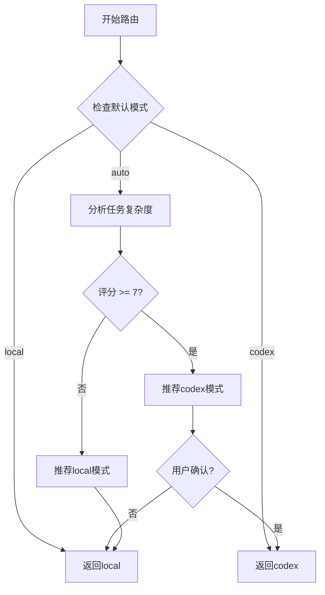

# TaskRouter - 任务路由器

## 概述

TaskRouter是Codex工作流编排系统的核心组件,负责智能分析任务复杂度并决定使用Codex深度分析还是本地Agent执行任务。

## 核心功能

### 1. 智能路由决策

基于三个维度的复杂度评分进行路由决策:
- **代码规模** (30%权重): 文件数量、代码行数
- **技术难度** (40%权重): 架构变更、新技术、异步复杂度等
- **业务影响** (30%权重): 核心功能、跨模块影响、API变更等

**路由阈值**: 复杂度评分 ≥ 7.0 推荐使用Codex模式

### 2. 推荐理由生成

自动生成人类可读的推荐理由:
- 代码规模因素 (如: "涉及15个文件")
- 技术难度因素 (如: "包含异步/并发处理")
- 业务影响因素 (如: "跨多个模块")
- 重构范围 (如: "需要跨文件重构")

### 3. 推荐置信度计算

基于三个维度评分的一致性计算置信度 (0-100):
- 评分越一致 → 置信度越高
- 评分越分散 → 置信度越低
- 极端评分 (≥9 或 ≤2) → 提升10%置信度

## 使用示例

### 基础路由

```typescript
import { TaskRouter } from './taskRouter';

const router = new TaskRouter(context, outputChannel);

const task: TaskDescriptor = {
  id: 'task-1',
  type: 'implementation',
  description: 'Implement complex async workflow with multiple modules',
  relatedFiles: ['src/workflow/executor.ts', 'src/workflow/state.ts']
};

// 自动路由决策
const mode = await router.route(task);
console.log(`Selected mode: ${mode}`); // 'codex' or 'local'
```

### 获取推荐信息

```typescript
// 仅获取推荐,不执行路由
const recommendation = await router.recommend(task);

console.log(`推荐模式: ${recommendation.mode}`);
console.log(`复杂度评分: ${recommendation.score}/10`);
console.log(`置信度: ${recommendation.confidence}%`);
console.log(`推荐理由:`);
recommendation.reasons.forEach(reason => {
  console.log(`  ${reason}`);
});
```

## 配置选项

### 默认执行模式

通过 `.claude/settings/kfc-settings.json` 配置:

```json
{
  "codex": {
    "defaultMode": "auto"  // 'local' | 'codex' | 'auto'
  }
}
```

- **local**: 始终使用本地Agent
- **codex**: 始终使用Codex深度分析
- **auto**: 基于复杂度评分自动决策 (默认)

## 路由决策流程



## 复杂度评分规则

### 代码规模评分 (1-10)

| 文件数量 | 评分 |
|---------|------|
| 0 (文档任务) | 1.0 |
| 1 | 2.0 |
| 2-3 | 4.0 |
| 4-5 | 6.0 |
| 6-10 | 8.0 |
| >10 | 10.0 |

**额外加分**: 每1000行代码 +0.5分 (最多+2.0)

### 技术难度评分 (1-10)

**基础评分** (按任务类型):
- requirements: 2.0
- design: 6.0
- tasks: 3.0
- implementation: 7.0
- review: 5.0
- debug: 8.0

**加分项**:
- 架构变更: +2.0
- 新技术引入: +1.5
- 异步/并发: +1.5
- 数据库相关: +1.0
- 性能优化: +1.0
- 安全相关: +1.0

### 业务影响评分 (1-10)

**基础评分**: 5.0

**加分项**:
- 核心功能: +3.0
- 多子系统: +2.0
- API变更: +2.0
- 数据完整性: +2.0
- 用户体验: +1.5

**减分项**:
- 简单文档任务: -3.0

## 测试覆盖

完整的单元测试覆盖以下场景:

### 1. 路由决策测试
- ✅ 固定模式 (local/codex)
- ✅ Auto模式 (评分<7 和 ≥7)
- ✅ 用户确认和拒绝
- ✅ 配置加载失败处理

### 2. 推荐生成测试
- ✅ 不同评分范围的推荐
- ✅ 边界值处理 (7.0)
- ✅ 推荐理由生成

### 3. 理由生成测试
- ✅ 代码规模理由
- ✅ 技术难度理由 (含多因素)
- ✅ 业务影响理由 (含多因素)
- ✅ 重构范围理由
- ✅ 默认理由

### 4. 置信度计算测试
- ✅ 评分一致 → 高置信度
- ✅ 评分分散 → 低置信度
- ✅ 极端评分 → 提升置信度
- ✅ 置信度范围 (0-100)

### 5. 边界条件测试
- ✅ 异常处理
- ✅ 缺失配置处理
- ✅ 边界值 (7.0, 6.9)

### 6. 日志记录测试
- ✅ 完整流程日志
- ✅ 推荐生成日志

## 示例场景

### 场景1: 简单需求任务

```typescript
const task = {
  id: 'req-1',
  type: 'requirements',
  description: 'Write requirements for user login feature'
};

// 复杂度评分: ~3.5
// 推荐模式: local
// 理由: 任务复杂度适中,本地Agent可以胜任
```

### 场景2: 复杂架构重构

```typescript
const task = {
  id: 'impl-1',
  type: 'implementation',
  description: 'Refactor async workflow engine with new architecture',
  relatedFiles: ['src/workflow/*', 'src/engine/*'] // 15个文件
};

// 复杂度评分: ~8.7
// 推荐模式: codex
// 理由:
//   • 代码规模较大 (评分: 9.0/10) - 涉及15个文件
//   • 技术难度很高 (评分: 9.0/10) - 包含: AST修改, 异步/并发处理
//   • 业务影响范围广 (评分: 8.0/10) - 跨多个模块
//   • 需要跨文件重构
// 置信度: 95%
```

### 场景3: 核心API设计

```typescript
const task = {
  id: 'design-1',
  type: 'design',
  description: 'Design new core API with breaking changes',
  context: {
    requirements: '...',
    additionalContext: { impactedModules: ['auth', 'storage', 'sync'] }
  }
};

// 复杂度评分: ~8.2
// 推荐模式: codex
// 理由:
//   • 技术难度较高 (评分: 8.0/10)
//   • 业务影响范围广 (评分: 9.0/10) - 跨多个模块, 影响核心API
// 置信度: 88%
```

## 扩展和自定义

### 自定义评分阈值

如需修改路由阈值,可在 `taskRouter.ts` 中调整:

```typescript
// 当前阈值: 7.0
const mode: ExecutionMode = score.total >= 7 ? 'codex' : 'local';

// 自定义阈值: 例如8.0
const CODEX_THRESHOLD = 8.0;
const mode: ExecutionMode = score.total >= CODEX_THRESHOLD ? 'codex' : 'local';
```

### 自定义推荐理由模板

在 `_generateReasons()` 方法中添加自定义逻辑:

```typescript
private _generateReasons(score: ComplexityScore): string[] {
  const reasons: string[] = [];

  // 添加自定义理由
  if (score.details.customMetric) {
    reasons.push('• 自定义因素: ...');
  }

  return reasons;
}
```

## API参考

### TaskRouter

#### 构造函数

```typescript
constructor(
  context: vscode.ExtensionContext,
  outputChannel: vscode.OutputChannel
)
```

#### 方法

##### route(task: TaskDescriptor): Promise<ExecutionMode>

执行完整的路由决策流程,包括用户确认

**参数**:
- `task`: 任务描述符

**返回**: 选择的执行模式 ('local' | 'codex')

##### recommend(task: TaskDescriptor): Promise<ModeRecommendation>

生成推荐结果,不执行用户确认

**参数**:
- `task`: 任务描述符

**返回**: 推荐结果对象

```typescript
interface ModeRecommendation {
  mode: ExecutionMode;        // 推荐模式
  score: number;              // 复杂度评分 (1-10)
  reasons: string[];          // 推荐理由列表
  confidence: number;         // 置信度 (0-100)
}
```

## 依赖关系

```
TaskRouter
  ├── ComplexityAnalyzer (复杂度分析)
  ├── ConfigManager (配置管理)
  └── vscode.window (用户确认对话框)
```

## 日志输出

所有路由决策都会记录到OutputChannel:

```
[TaskRouter] Starting route decision...
[TaskRouter] Task type: implementation, description: Implement complex...
[TaskRouter] Default mode from config: auto
[TaskRouter] Auto mode enabled, analyzing complexity...
[TaskRouter] Complexity score: {...}
[TaskRouter] Recommendation: codex, score: 8.5, confidence: 92
[TaskRouter] Codex mode recommended, requesting user confirmation...
[TaskRouter] User choice: 使用Codex (confirmed: true)
[TaskRouter] User confirmed Codex mode
```

## 最佳实践

1. **配置auto模式**: 让系统智能决策,避免手动选择
2. **查看推荐理由**: 理解为什么推荐某个模式
3. **监控置信度**: 低置信度(<70%)时可能需要人工判断
4. **审查日志**: 通过日志了解决策过程
5. **提供文件列表**: 在TaskDescriptor中提供relatedFiles以提高评分准确性

## 性能考虑

- **复杂度分析**: 通常在100-500ms内完成
- **用户确认**: 等待用户响应 (无超时)
- **无副作用**: route()和recommend()都不修改任务状态

## 已知限制

1. **文件数量估算**: 未提供relatedFiles时依赖关键词推测,可能不准确
2. **AST分析缺失**: 当前版本未实现圈复杂度和认知复杂度计算
3. **学习能力**: 暂未实现用户偏好学习 (计划在Task 14实现)

## 版本历史

- **v0.1.0** (2025-11-18): 初始实现
  - 基础路由决策
  - 复杂度评分推荐
  - 用户确认机制
  - 推荐理由生成
  - 置信度计算
  - 完整单元测试覆盖

## 贡献指南

添加新功能或修改路由逻辑时:

1. 更新类型定义 (types.ts)
2. 实现功能代码
3. 添加单元测试 (测试覆盖率 >90%)
4. 更新文档
5. 验证编译无错误

## 相关文档

- [ComplexityAnalyzer](./complexityAnalyzer.ts) - 复杂度分析引擎
- [Types](./types.ts) - 核心类型定义
- [设计文档](../../../.claude/specs/codex-workflow-orchestration/design.md)
- [任务清单](../../../.claude/specs/codex-workflow-orchestration/tasks.md)
